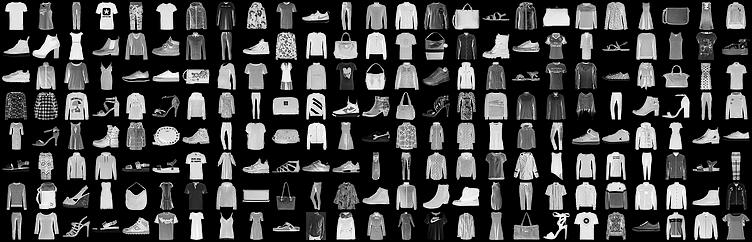
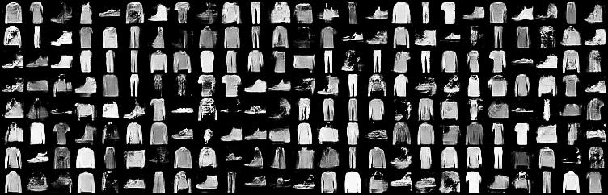

# PyTorch Wasserstein GAN

A barebones implementation of [Wasserstein GAN (Arjovsky et al., 2017)](https://arxiv.org/abs/1701.07875) in Pytorch, applied to the Fashion-MNIST dataset. Training takes roughly an hour on an Amazon GPU Instance.

## Requirements

Python3 with PyTorch, torchvision and NumPy. CUDA and cuDNN are optional (settable within the script in a self-explanatory way) but strongly recommended.

## To use

Generate output images with:
```bash
python3 fashion_mnist_gan.py
```

Consolidate output images into a training gif and sample some actual data with:
```bash
python3 consolidate_output.py
```

## Results

Actual data from Fashion-MNIST:


Generated data from the Wasserstein GAN after 150 epochs. Randomly chosen samples, they have not been cherry picked:


Training progress GIF. One frame per epoch, up to epoch 100:

